* 首页
    * 切换站点：切换到你需要监控的站点。
     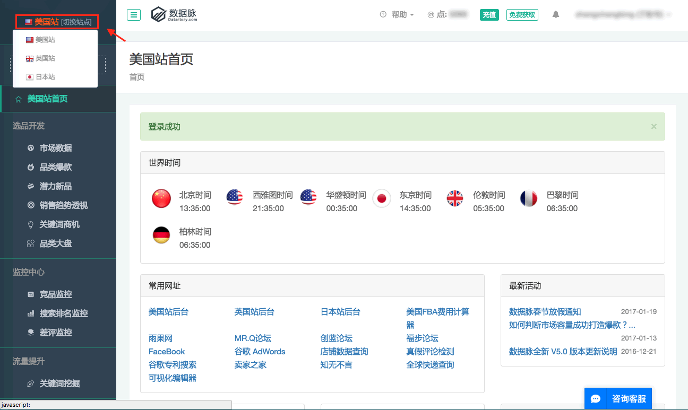
    * 帮助：联系QQ客服或下载《数据脉V5操作指南》。
     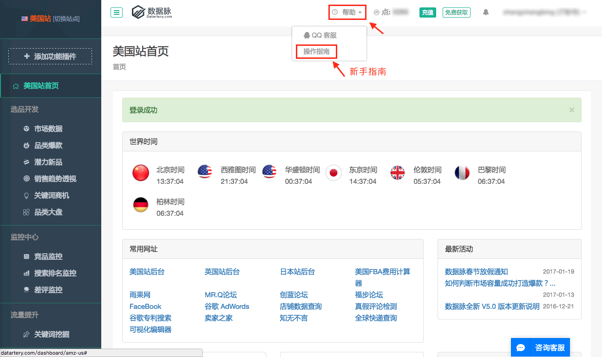
    * 充值：
        * 充值M点：根据需要充值M点。
         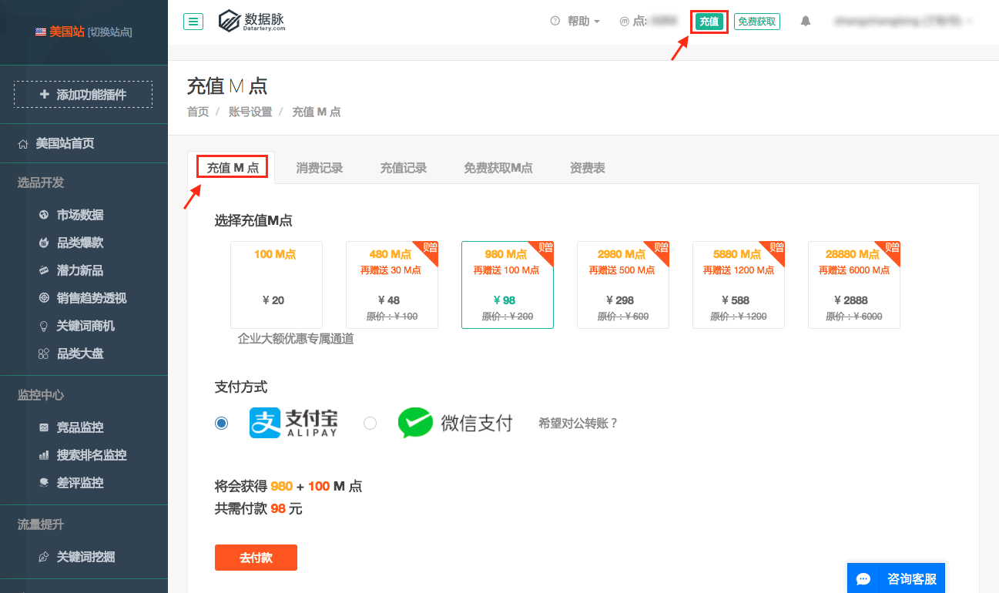
        * 消费记录：查询M点使用情况。
         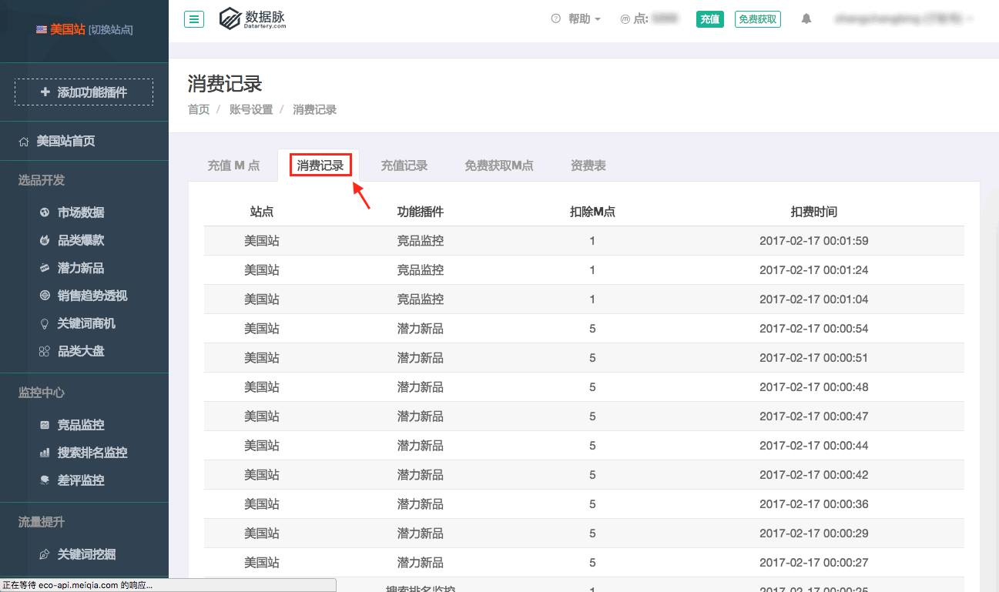
        * 充值记录：查询M点充值情况。
         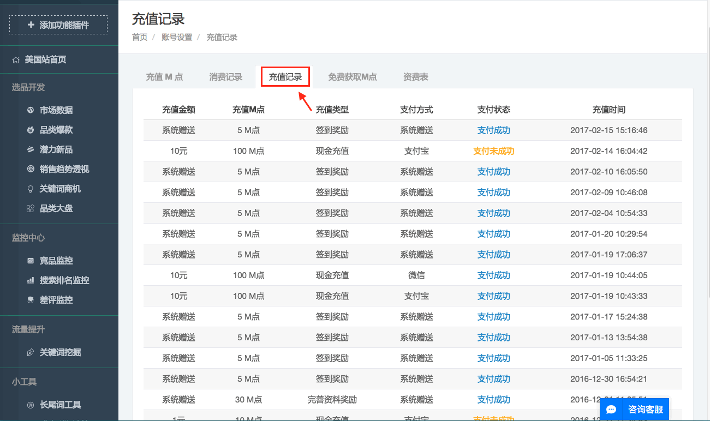
        * 免费获取M点：每日签到，分享到新浪微博，绑定邮箱，邀请好友注册，完善个人资料都可以获取相应的M点。
         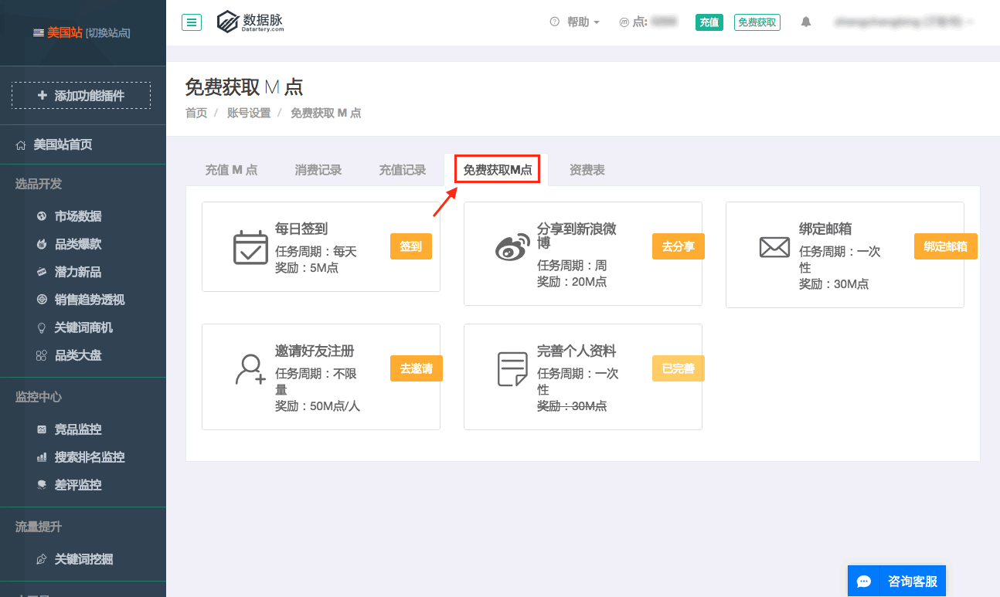
        * 资费表：了解相关功能的收费标准。
         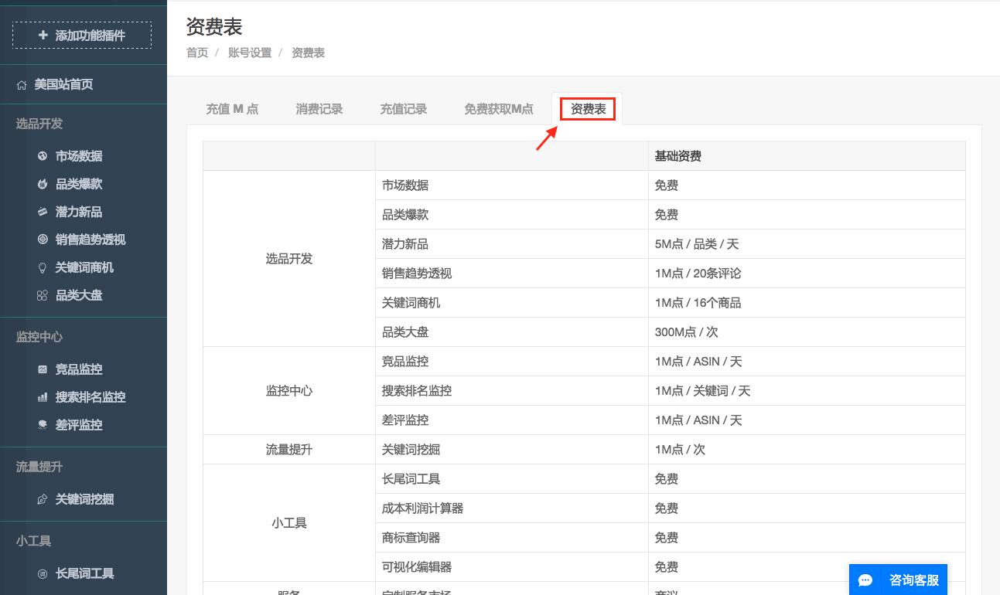
    * 账户管理：查看充值及消费记录，管理子账号，修改密码，登出账号。
     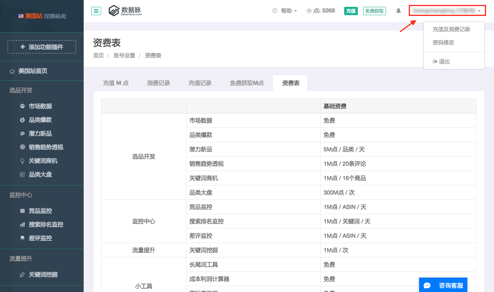
    * 世界时间：查看各地时间。
     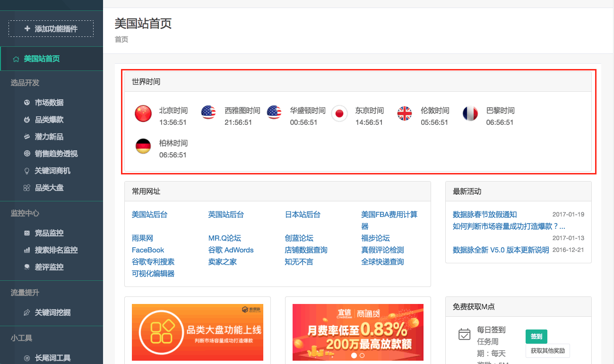
    * 常用网址：卖家常用网址列表。
     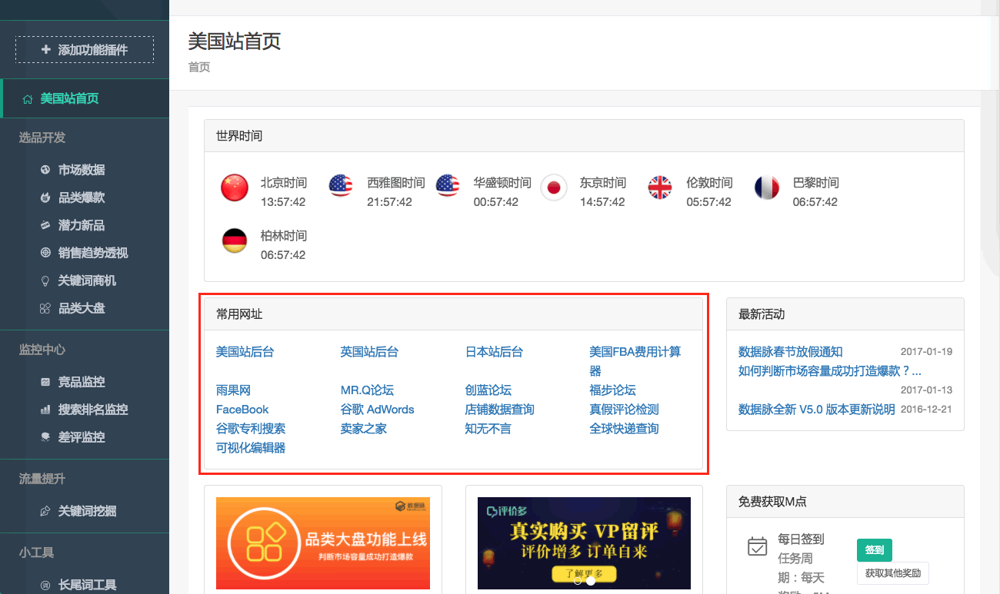
    * 最新活动：产品活动及产品运行相关通知说明。
     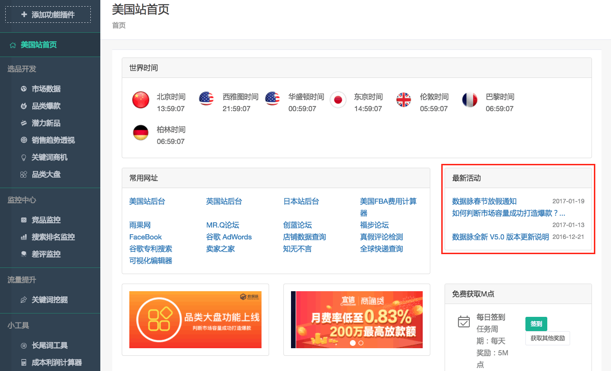
    * 免费获取M点：每日签到可免费领取M点，或通过其他方式免费获取M点。
     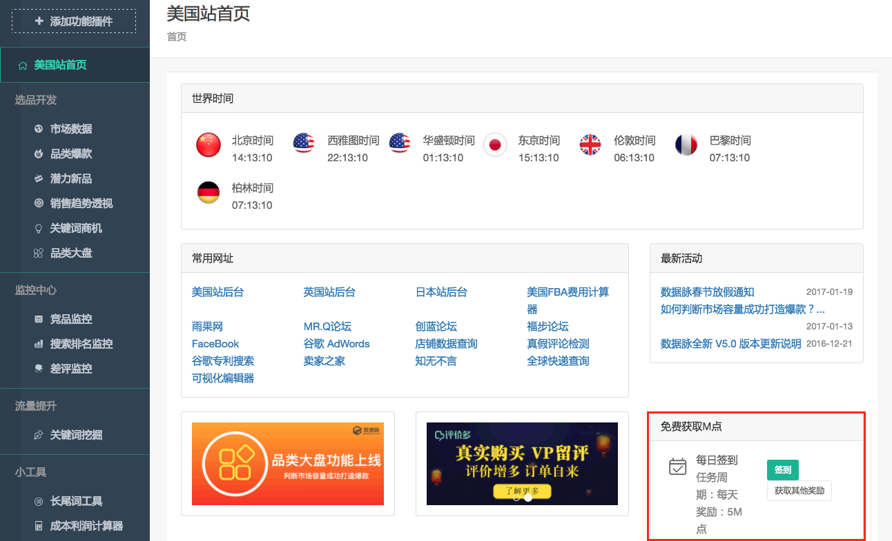