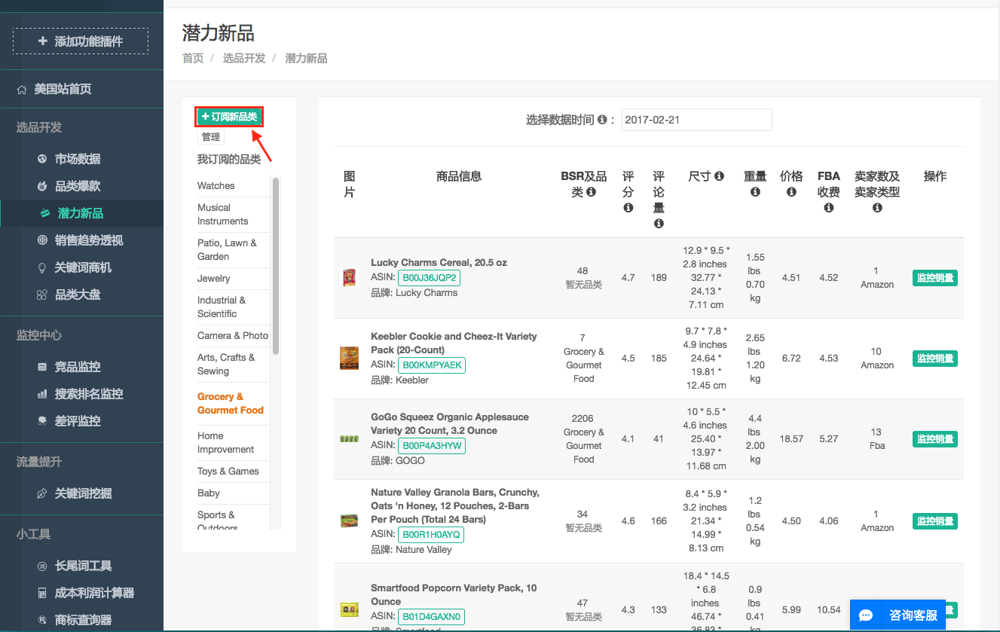
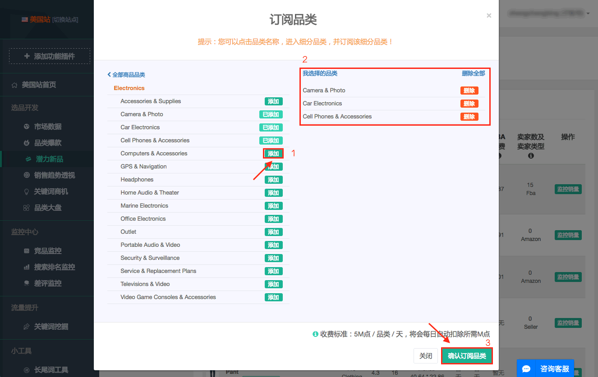
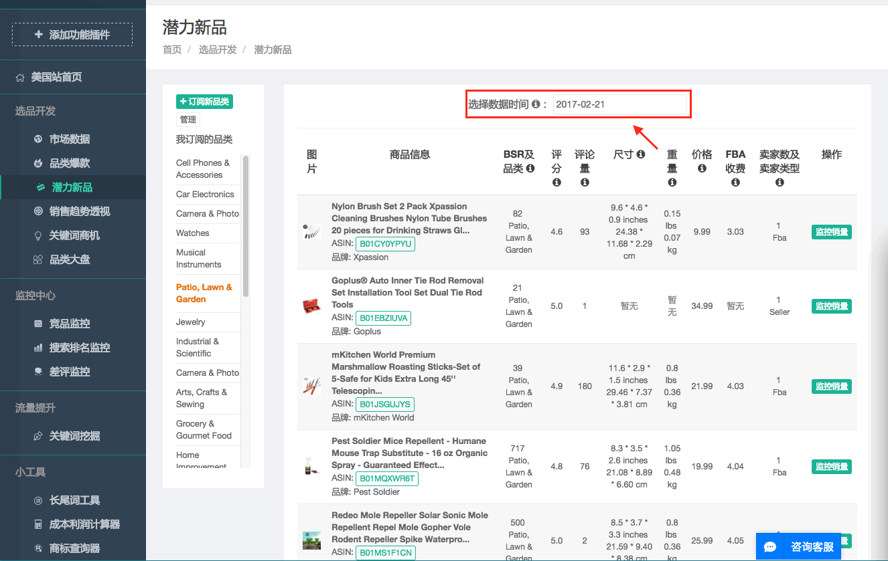
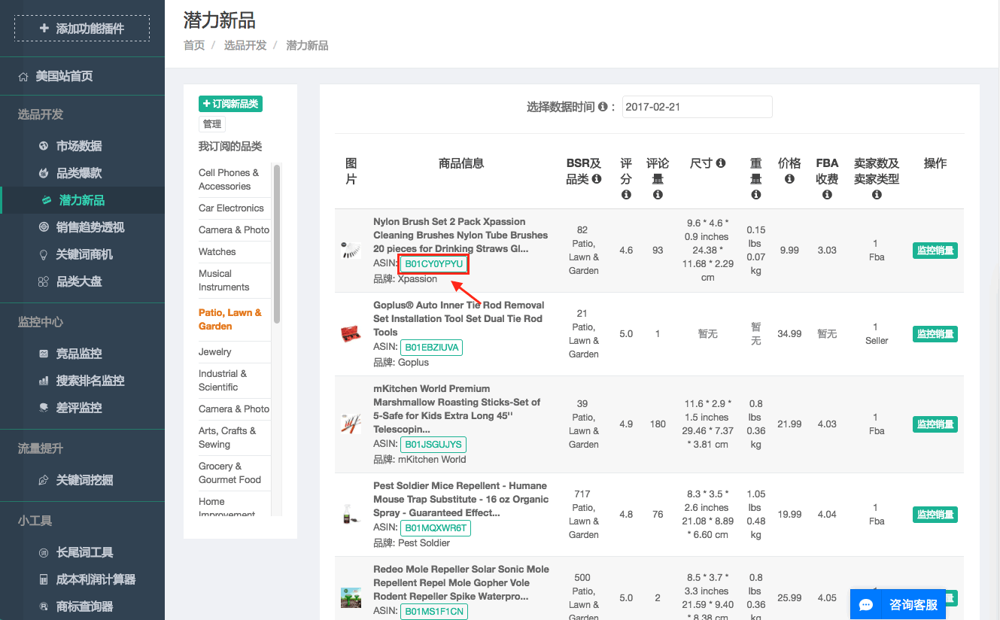
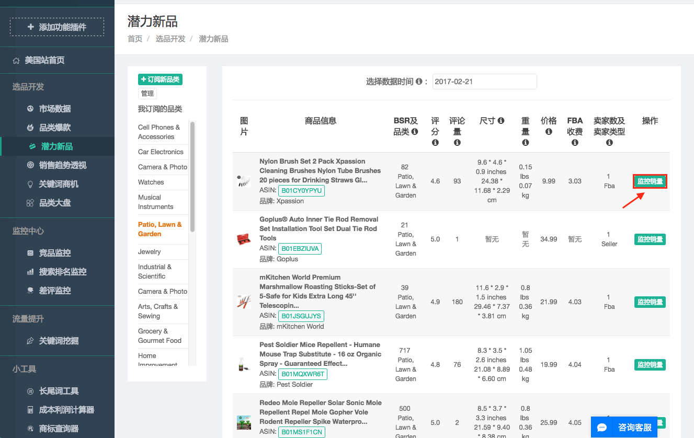

* 潜力新品
    * 订阅新品类：点击品类名称，进入细分品类。点击“添加”，将该品类加入选择列表，点击“确认订阅品类”将选择列表加入订阅列表。
     
     
    *  我订阅的品类：点击品类名称，查看该品类的潜力新品。
     
    * 选择数据时间：潜力新品的数据每日更新一次，您可以选择具体要查看的那天的数据。
     
    * ASIN：点击“ASIN”跳转至该商品的亚马逊页面。
     
    * 监控销量：点击“监控销量”，将该商品加入销量监控列表。
     