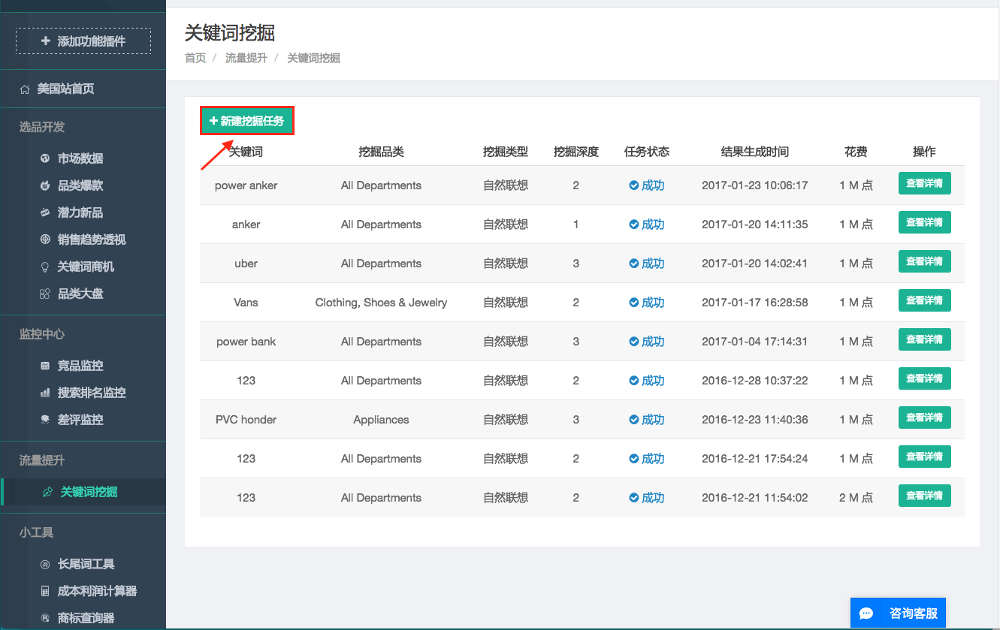
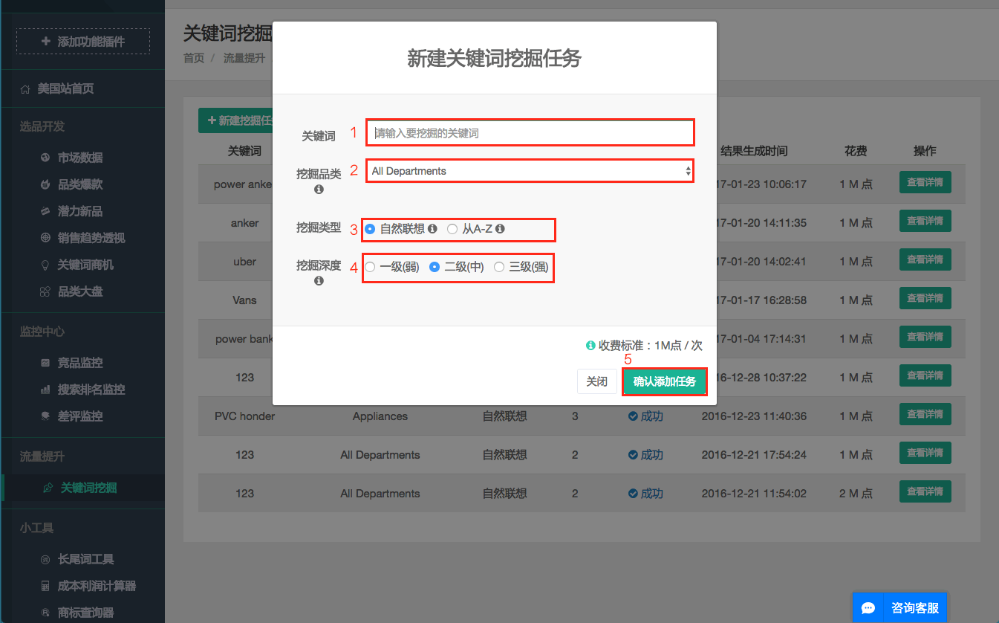
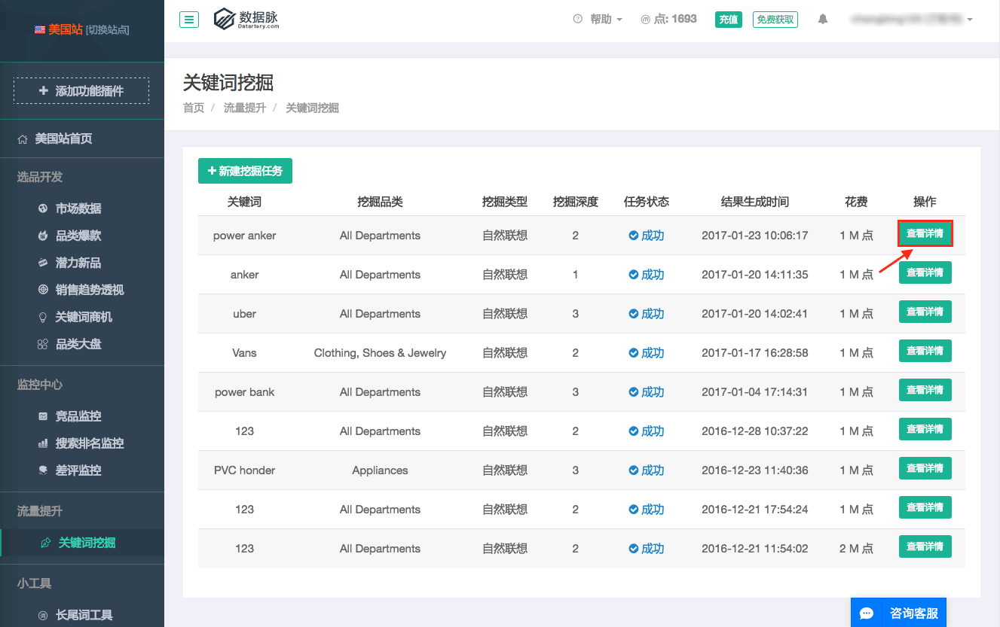
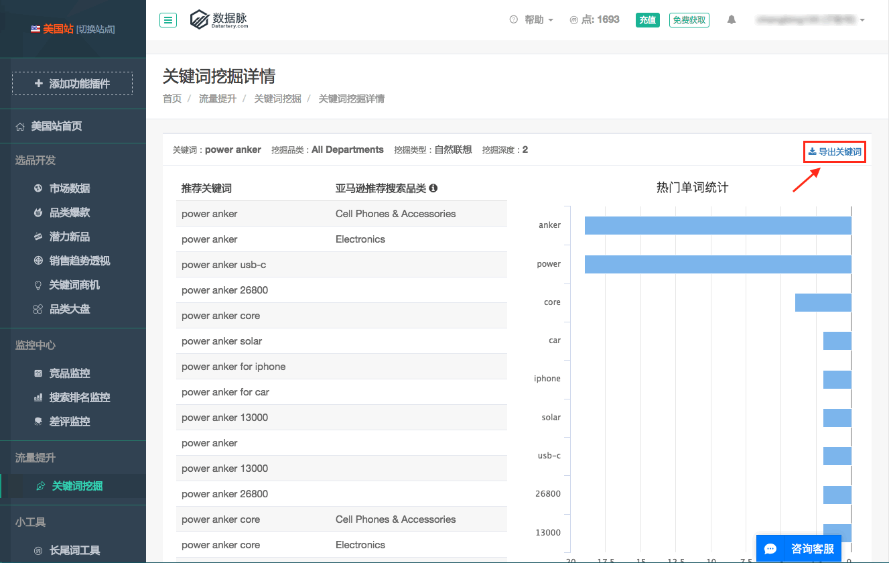
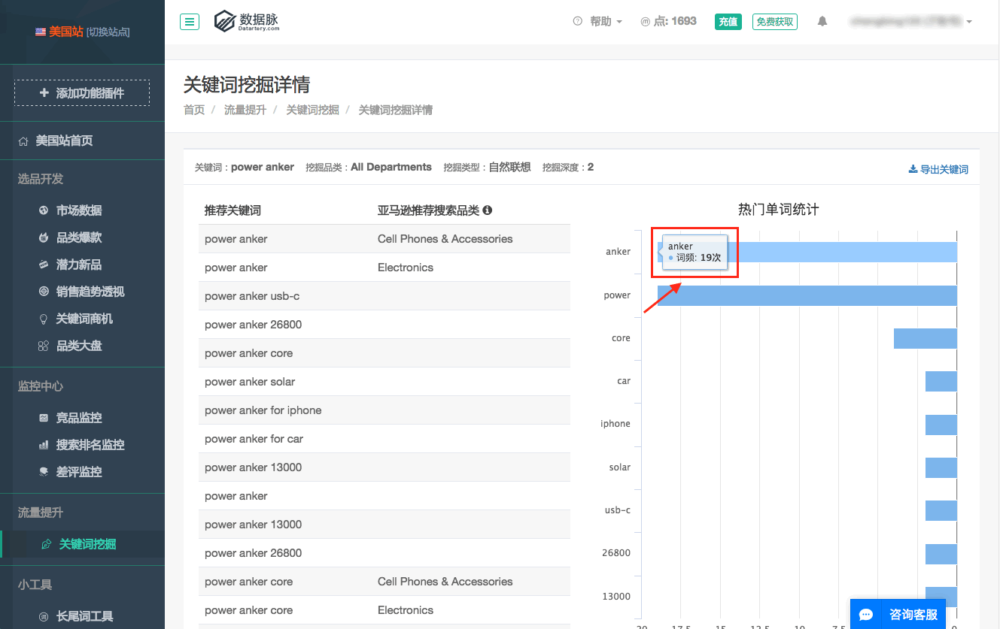

# 关键词挖掘

* 新建挖掘任务：
 
    * 1-输入要挖掘的关键词。 2-选择要挖掘关键词的所属品类。 3-选择挖掘类型：自然联想根据亚马逊关键词联想规则去挖掘关键词，通常比较热门。 从A-Z根据字母A到字母Z的规则去探测挖掘关键词，通常比较长尾。 4-选择挖掘深度：挖掘深度越强，关键词的数量越多；挖掘深度越弱，关键词搜索量越大。
    
* 查看详情：
 
    * 点击图标，导出关键词文本列表。
     
    * 悬浮光标，查看具体词频数据。
     