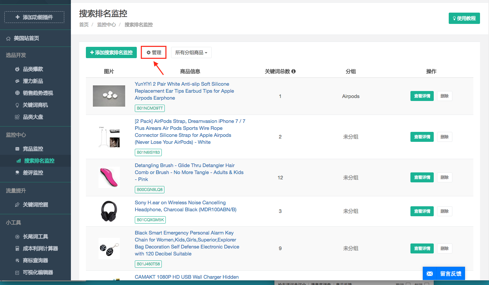

# 搜索排名监控

* 添加搜索排名监控：1-输入您要监控的商品ASIN。2-输入您要监控排名的关键词，多个关键词用回车分隔。
 
* 监控详情：
 
    * ASIN：点击进入该商品的亚马逊页面。
     
    * 添加关键词：输入要监控排名的关键词，多个关键词请用回车分隔。
     
     
    * 选择数据日期区间
       
* 分组商品  
    * 在搜索排名监控里可以将您监控的的商品分组，方便您查找与管理所监控的竞品。   
      
    * 点击“管理”  
      
    * 将该商品添加到您的分组，最底部的的新建框可建立新的分组。   
    
    * 管理分组
    
    * 点击“创建新分组”可以创建新的分组，点击“修改”可以给对应的分组重命名。
    
