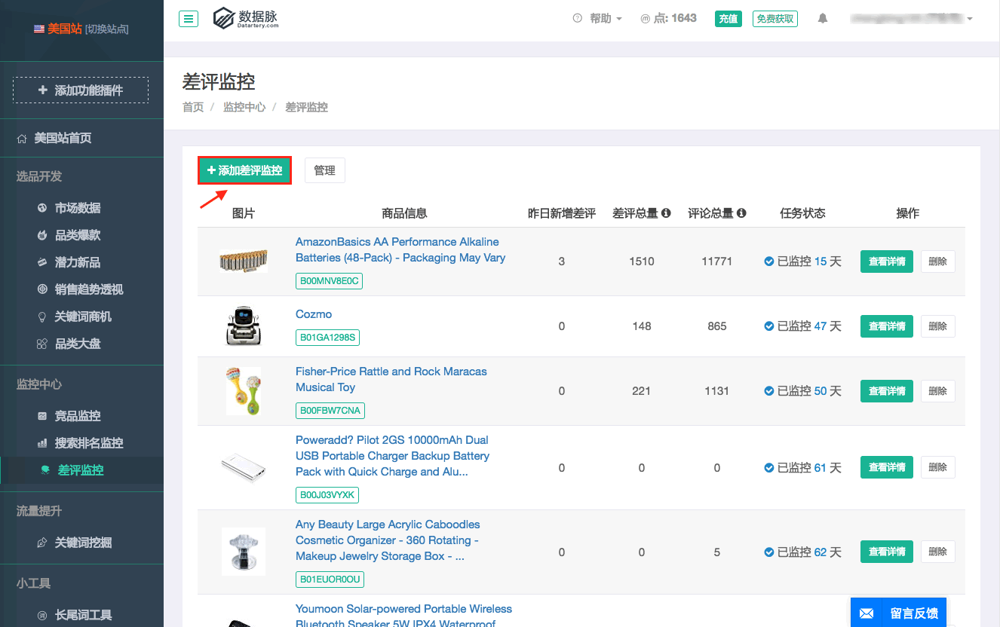
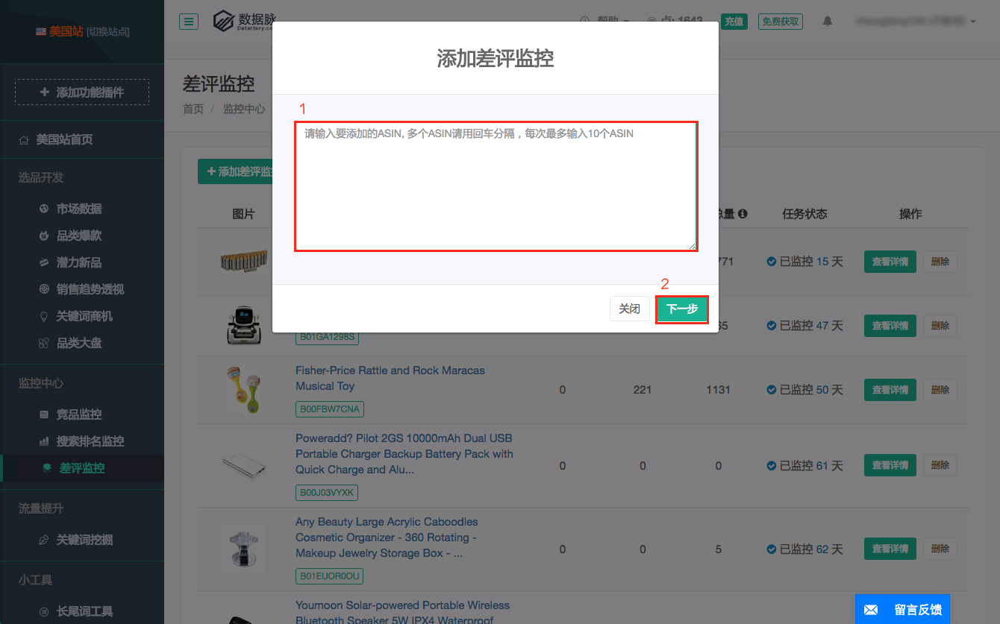
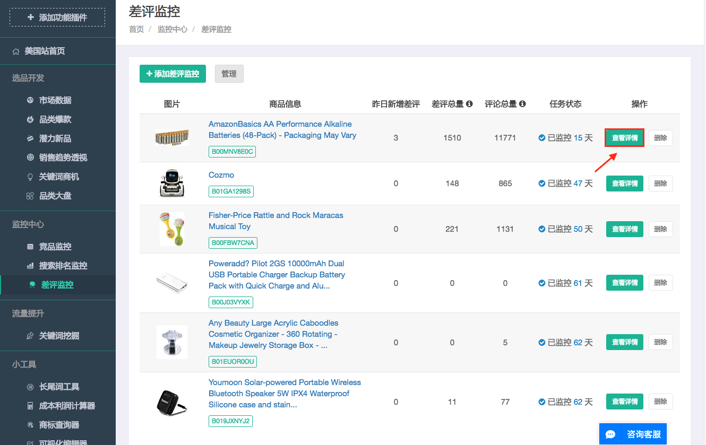
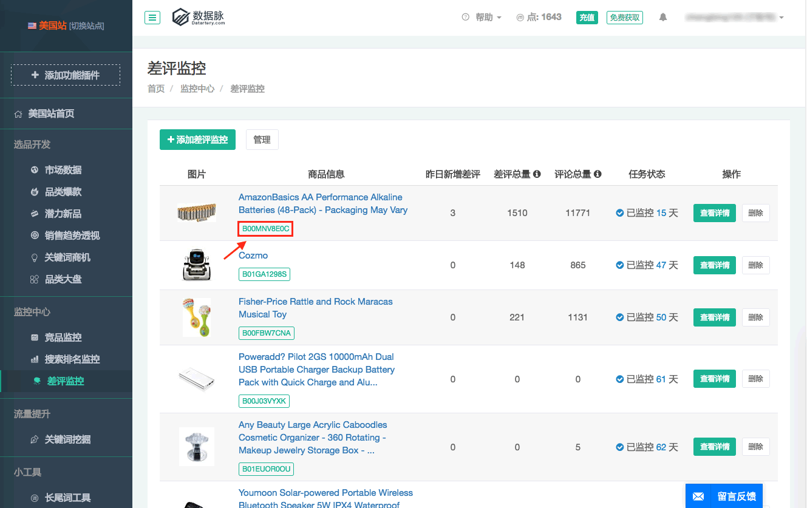
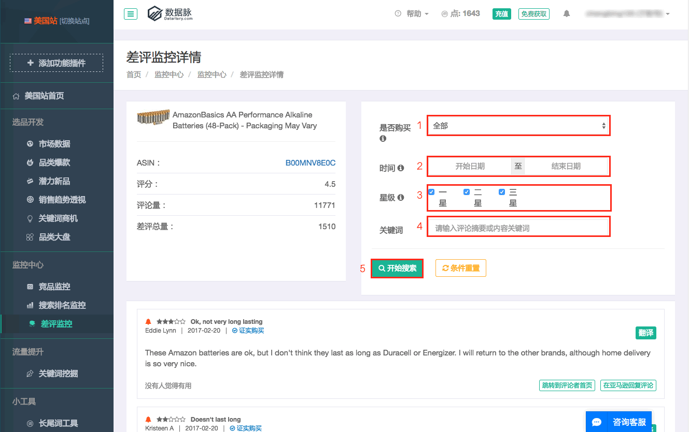
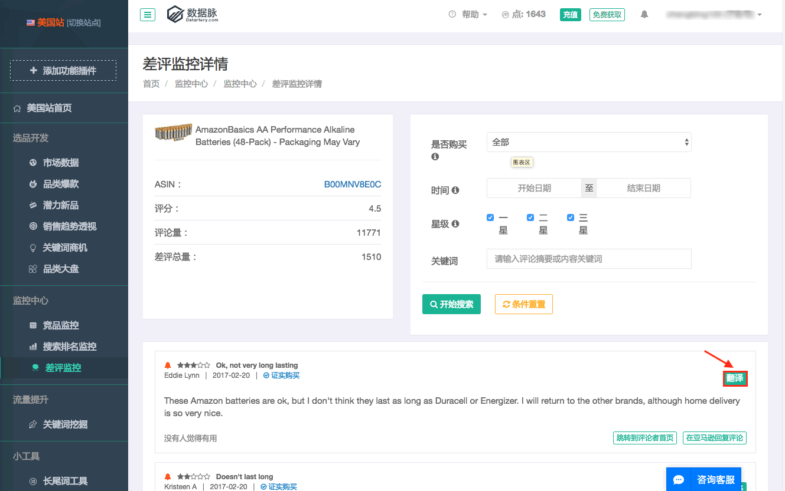
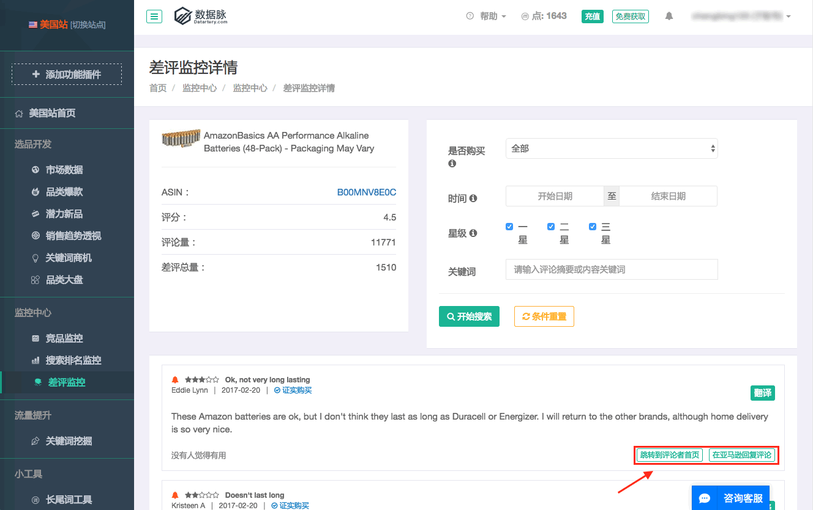

# 差评监控

* 添加差评监控：输入要添加的ASIN，多个ASIN请用回车分隔，每次最多输入10个ASIN。
 
 
* 查看详情：
 
    * ASIN：跳转至该商品的亚马逊页面。
     
    * 1-选择是否证实购买。  2-输入日期范围。 3-选择星级范围。4-输入评论摘要或内容关键词。 5-开始搜索
     
    * 翻译：一键翻译该评论。
     
    * 跳转到评论者首页 / 在亚马逊回复该评论。
     